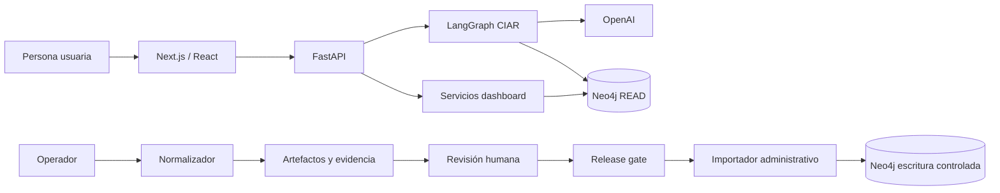
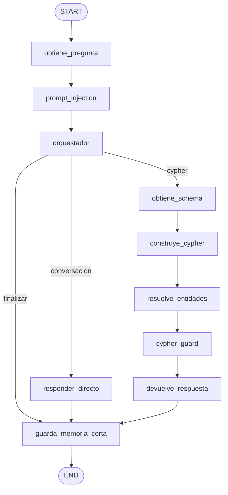
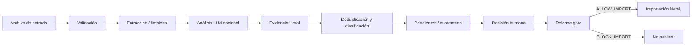

# CIAR — Documentación técnica integral

**Estado documentado:** 26 de agosto de 2026  
**Código auditado:** rama `main`, commit `4c24bc0`  
**Propósito:** describir la implementación real del sistema a partir del código vigente.

Esta documentación es autocontenida. Describe el comportamiento implementado, los límites conocidos y la verificación ejecutada. La fuente técnica para resolver cualquier diferencia futura es el código activo del repositorio.

## 1. Qué es CIAR

CIAR es una aplicación para explorar información académica y de empleabilidad de la Universidad de Lima. El sistema combina:

- un agente conversacional en español;
- un grafo de conocimiento Neo4j;
- un dashboard de tendencias;
- un normalizador de información de empleabilidad;
- un normalizador de sílabos;
- una etapa administrativa de importación controlada al grafo.

El agente recibe una pregunta, determina si pertenece al dominio, obtiene el schema vigente de Neo4j cuando necesita datos, genera una consulta Cypher parametrizada, la valida como solo lectura, la ejecuta por un gateway de lectura y redacta una respuesta acotada.

La aplicación no pretende medir por sí sola contratación, inserción laboral, dominio individual del estudiante ni causalidad entre currícula y empleo. El grafo representa publicaciones y relaciones declaradas en la fuente de datos.

## 2. Estado actual

### 2.1 Resumen ejecutivo

El núcleo de CIAR está implementado y es verificable en local. La cadena principal de consulta tiene controles de seguridad en varias capas y la suite automatizada cubre el backend, el frontend y la construcción del grafo.

El sistema todavía debe considerarse **desarrollo avanzado / pre-productivo** porque la aceptación contra Neo4j y OpenAI reales no se ejecutó en este corte, no hay autenticación de usuario ni rate limiting en la frontera HTTP, y la operación distribuida todavía no está resuelta.

### 2.2 Indicadores del corte

| Indicador | Resultado |
|---|---|
| Nodos lógicos del grafo activo | 12 |
| Tests backend | 606 passed, 9 skipped intencionales |
| Ruff | Correcto |
| Compilación Python | Correcta |
| Tests frontend | 54 passed en 10 archivos |
| Build frontend | Correcto |
| Auditoría npm offline | 0 vulnerabilidades reportadas |
| mypy | 3 errores pendientes |
| Consulta live contra Neo4j | No ejecutada en este corte |
| Render especializado del PowerPoint | No disponible en la sesión por falta de `RUNTIME_NODE_MODULES` |

### 2.3 Clasificación de madurez

| Superficie | Estado | Explicación |
|---|---|---|
| Agente conversacional | Implementado | Routing determinista, conversación directa y ruta de consulta |
| Generación Cypher | Implementado | Schema vivo, salida estructurada, parámetros y dos intentos máximos |
| Seguridad de consulta | Implementado | Guardias de prompt, guardia Cypher y gateway Neo4j READ |
| Memoria | Implementado con alcance limitado | Memoria corta en proceso; no es durable ni compartida |
| Dashboard | Implementado parcialmente | 7 datasets activos y 5 diferidos |
| Normalizador | Implementado parcialmente | Flujo documental, revisión y release gate; worker local |
| Importación | Implementado | Separada del chatbot y protegida por credenciales de ingestión |
| Seguridad de producto | Parcial | Falta identidad de usuario, autorización y limitación de abuso |
| Despliegue | No documentado como productivo | No se observa pipeline CI/CD, contenedorización ni prueba de carga versionada |

## 3. Arquitectura general

### 3.1 Contexto



### 3.2 Separación de responsabilidades

El sistema tiene dos planos de datos:

#### Plano de consulta

Incluye chat, streaming y dashboard. Sus consultas se validan como lectura y llegan a Neo4j con `RoutingControl.READ`. El plano no acepta Cypher arbitrario desde la API pública.

#### Plano de curación y publicación

Incluye cargas de empleabilidad, cargas de sílabos, decisiones humanas e importación. La escritura usa credenciales `NEO4J_INGEST_*`, está separada de las credenciales de lectura y requiere pasar el release gate.

### 3.3 Componentes principales

| Componente | Ubicación principal | Responsabilidad |
|---|---|---|
| API HTTP | `backend/api/servidor.py` | FastAPI, endpoints, streaming, sanitización y correlación |
| Constructor del grafo | `backend/agente/grafo/constructor.py` | Registra nodos y conexiones del LangGraph activo |
| Estado del agente | `backend/agente/estado.py` | Estado compartido entre nodos |
| Routing | `backend/agente/nodos/orquestador.py` | Clasificación determinista de conversación, Cypher o cierre |
| Schema Neo4j | `backend/agente/utils/neo4j_schema.py` | Snapshot live y cache temporal |
| Generación | `backend/agente/nodos/construye_cypher.py` | Generación estructurada y validación previa |
| Resolución | `backend/agente/nodos/resuelve_entidades.py` | IDs, cardinalidad y entidades ambiguas |
| Guardia | `backend/agente/nodos/cypher_guard.py` | Política final fail-closed |
| Gateway de lectura | `backend/agente/utils/db.py` | `EXPLAIN`, ejecución READ y normalización |
| Respuesta | `backend/agente/nodos/devuelve_respuesta.py` | Resultado Neo4j y respuesta determinista |
| Memoria | `backend/agente/utils/memoria_corta.py` | Contexto corto por scope |
| Dashboard | `backend/agente/dashboard/` | Queries allow-listed, métricas y cache |
| Normalizador | `backend/agente/normalizador/` | Limpieza, evidencia, decisiones y outputs |
| Importador | `backend/agente/db/neo4j_importador.py` | Publicación administrativa y reversión |
| Frontend | `frontend/app/`, `frontend/src/` | Chat, dashboard e inspección curricular |

## 4. Flujo del agente conversacional

### 4.1 Grafo activo



### 4.2 Nodos y función

1. `obtiene_pregunta`: recibe y normaliza la pregunta del usuario.
2. `prompt_injection`: detecta instrucciones maliciosas en la entrada original.
3. `orquestador`: decide de forma determinista entre conversación, consulta o finalización.
4. `responder_directo`: usa OpenAI para una respuesta conversacional fuera de la ruta de datos.
5. `obtiene_schema`: obtiene el schema live de Neo4j en un hilo separado y usa cache TTL.
6. `construye_cypher`: solicita Cypher estructurado y parametrizado a OpenAI.
7. `resuelve_entidades`: busca candidatos, valida cardinalidad y conserva IDs confiables.
8. `cypher_guard`: aplica la política final de solo lectura y límites.
9. `devuelve_respuesta`: ejecuta la consulta a través del gateway y produce una respuesta estable.
10. `guarda_memoria_corta`: almacena únicamente turnos exitosos y acotados.

La contextualización automática de seguimientos está temporalmente fuera del grafo. Las
funciones auxiliares se conservan aisladas, pero no leen memoria ni inyectan texto en los
prompts del orquestador o del generador.

### 4.3 Routing determinista

El orquestador usa conjuntos de tokens de conversación, dominio académico/empleabilidad y conceptos de grafo. El modelo no decide libremente qué herramienta invocar.

- Pregunta conversacional conocida: ruta `responder_directo`.
- Pregunta dentro del dominio con entidades o conceptos de grafo: ruta Cypher.
- Pregunta fuera del dominio: respuesta segura de fuera de alcance.
- Intención de cierre: memoria y fin del grafo.

El routing reduce la superficie de ataque y hace más predecible la selección de la ruta, aunque depende de que los vocabularios de dominio se mantengan actualizados.

## 5. Cadena de seguridad Cypher

### 5.1 Secuencia de confianza

```text
pregunta
  → guardia de prompt
  → schema vivo
  → Cypher estructurado y parametrizado
  → resolución de entidades
  → guardia final
  → EXPLAIN READ
  → ejecución READ
  → normalización de datos
```

### 5.2 Reglas de generación

El generador recibe el snapshot del schema y debe producir una consulta estrecha. La política permite patrones de lectura, filtros, proyección explícita, ordenamiento y límite.

Se restringe o rechaza:

- `CREATE`, `MERGE`, `DELETE`, `DETACH DELETE`, `SET`, `REMOVE` y otras escrituras;
- `CALL`, `UNION`, `USE`, procedimientos y subconsultas no autorizadas;
- valores de usuario incrustados como literales;
- ausencia de fuente de lectura o de `RETURN`;
- ausencia de un `LIMIT` final;
- límites fuera de 1–100;
- retornos completos de nodos o relaciones;
- uso incorrecto de IDs como texto libre;
- etiquetas, relaciones o propiedades incompatibles con el schema recibido.

### 5.3 Gateway Neo4j

`backend/agente/utils/db.py` encapsula la interacción con Neo4j:

1. recibe una consulta que ya pasó el guardia;
2. ejecuta `EXPLAIN` con `RoutingControl.READ`;
3. exige un plan de lectura (`r`);
4. falla ante warnings de schema;
5. ejecuta la consulta con `RoutingControl.READ`;
6. revisa nuevamente tipo de operación y warnings;
7. normaliza fechas, nodos, relaciones, listas y valores Neo4j para JSON.

El timeout de consulta por defecto es de 10 segundos. Las credenciales dedicadas de lectura deben estar completas; un grupo `NEO4J_READ_*` parcial no cae silenciosamente a otro grupo.

### 5.4 Schema vivo

El schema se actualiza desde Neo4j y se conserva en un snapshot inmutable con representación textual y estructurada. La cache tiene TTL por defecto de 900 segundos.

El código actual evita asumir etiquetas rígidas. En el grafo auditado aparece, por ejemplo, `Oferta_Laboral`; la etiqueta, relaciones y propiedades reales deben provenir de la instancia conectada.

## 6. Memoria, streaming y observabilidad

### 6.1 Memoria corta

La memoria de `backend/agente/utils/memoria_corta.py` es local al proceso:

- TTL por defecto: 30 minutos;
- máximo de turnos por scope: 4;
- máximo de scopes: 256;
- máximo de entradas: 512;
- locks por scope para concurrencia;
- scope derivado mediante HMAC;
- solo se guarda un turno exitoso.

`thread_id` funciona como correlación pública. El grafo no usa checkpointer durable y la memoria no se comparte entre réplicas.

### 6.2 Streaming

`POST /chat/stream` traduce estados internos a fases públicas. El servidor:

- limita el tiempo total del grafo;
- filtra qué contenido textual puede salir;
- sanitiza el estado público;
- vuelve a validar la consulta Cypher antes de exponerla;
- oculta IDs y campos internos que no forman parte del contrato público.

La interfaz muestra fases, consulta autorizada, entidades y errores seguros. No se expone razonamiento privado del modelo.

### 6.3 Logs y tracing

La observabilidad usa logs JSON estructurados. El logger limita profundidad, longitud y cantidad de elementos, redacta claves sensibles y puede hashear identificadores de sesión. LangSmith es opcional y se utiliza para tracing de flujos configurados, no para publicar razonamiento privado.

## 7. API HTTP

### 7.1 Chat

| Método | Ruta | Entrada principal | Salida principal |
|---|---|---|---|
| GET | `/health` | Ninguna | Estado básico del servicio |
| POST | `/chat` | `pregunta`, `id_sesion?`, `thread_id?` | `respuesta`, `thread_id` |
| POST | `/chat/stream` | Payload de streaming compatible con LangGraph | Fases y estado público |
| POST | `/preguntar` | Entrada compatible con la interfaz anterior | Respuesta conversacional |

Ejemplo mínimo de `/chat`:

```json
{
  "pregunta": "¿Qué herramientas se enseñan en Ingeniería Industrial?",
  "thread_id": "demo-001"
}
```

La respuesta incluye el identificador de correlación para continuar una conversación corta.

### 7.2 Dashboard

Rutas principales:

| Ruta | Uso |
|---|---|
| `/dashboard/metadata` | Metadatos y disponibilidad de datasets |
| `/dashboard/filtros/carreras` | Carreras disponibles para filtros |
| `/dashboard/ofertas/tendencia` | Serie temporal de publicaciones |
| `/dashboard/carreras/demanda` | Ranking de carreras por demanda publicada |
| `/dashboard/carreras/{carrera_id}/industrias` | Industrias relacionadas con una carrera |
| `/dashboard/empresas` | Empresas con publicaciones |
| `/dashboard/dimensiones/{tipo}/demanda` | Demanda por competencia, habilidad o herramienta |
| `/dashboard/dimensiones/{tipo}/cobertura` | Cobertura curricular declarada |
| `/dashboard/dimensiones/{tipo}/brechas` | Diferencia entre demanda y cobertura |
| `/dashboard/dimensiones/{tipo}/industrias` | Industrias por elemento seleccionado |

Los tipos permitidos son `competencias`, `habilidades` y `herramientas`. Las consultas son allow-listed; el límite de servicio es 25 y el rango de fechas máximo documentado es de 10 años.

### 7.3 Normalizador

El router `/normalizador` administra:

- creación de ejecuciones de empleabilidad y sílabos;
- consulta de estado, reporte y errores;
- descarga controlada de outputs;
- pendientes y cuarentena;
- decisiones humanas;
- release gate;
- cancelación de ejecuciones;
- historial de ejecuciones terminales.

### 7.4 Importación administrativa

El router `/neo4j` administra:

- estado de importación;
- validación previa;
- importación aprobada;
- historial de importaciones;
- reversión por identificador de importación.

Estas rutas no forman parte del flujo conversacional y deben protegerse a nivel de despliegue con autenticación y autorización antes de exponerlas fuera de un entorno controlado.

## 8. Dashboard: datos activos y límites

### 8.1 Datasets activos

Actualmente se implementan siete familias de consulta:

1. tendencia de ofertas;
2. carreras con mayor demanda;
3. industrias por carrera;
4. conocimientos más demandados;
5. cobertura curricular;
6. brechas de demanda alta;
7. empresas y conocimientos.

### 8.2 Datasets diferidos

Cinco familias aparecen como no disponibles para resultados live:

- señales de revisión de vigencia;
- cursos con mayor correspondencia;
- diferenciadores entre empresas;
- conocimientos asociados a liderazgo;
- funciones por tipo de empresa.

El frontend puede mostrar un estado de no disponibilidad. No debe sustituir esas métricas por resultados analíticos inventados.

### 8.3 Interpretación correcta

El dashboard puede describir:

- cantidad de ofertas publicadas;
- empresas e industrias que publican;
- títulos publicados;
- requisitos declarados;
- cobertura curricular declarada.

No puede afirmar por sí solo:

- contratación o empleo efectivo;
- inserción laboral de egresados;
- dominio de una competencia por parte de un estudiante;
- tamaño de empresa si no existe ese dato;
- función laboral normalizada a partir de un título;
- causalidad entre enseñanza y demanda.

Una tabla vacía no equivale automáticamente a cero. La aplicación debe conservar disponibilidad, denominadores, advertencias y soporte del cálculo.

## 9. Normalizador de empleabilidad y sílabos

### 9.1 Arquitectura de ejecución



### 9.2 Ejecuciones

Cada ejecución se identifica como `NOR_<id>` y mantiene un directorio de trabajo `.normalizador/` con manifest y artefactos. El gestor usa un `ThreadPoolExecutor` de un worker, por lo que la ejecución es local y serializada.

Estados utilizados por el ciclo de normalización:

`recibido`, `validando`, `validado`, `validado_con_advertencias`, `limpiando`, `limpiado`, `limpiado_con_advertencias`, `normalizando`, `normalizado`, `normalizado_con_advertencias`, `no_publicado`, `rechazado`, `error` y `cancelado`.

### 9.3 Empleabilidad XLSX

La entrada valida tres roles de hoja:

- `Convenios`;
- `Informes`;
- `Publicaciones`.

El proceso calcula hash de la fuente, genera staging JSONL, crea catálogo CHH, registra evidencia y conserva pendientes. La validación no depende de años fijos.

### 9.4 Sílabos

La entrada acepta DOCX, PDF y ZIP dentro de límites de tamaño y seguridad. Se validan carrera, periodo, metadatos, sumilla, logro general, logros específicos y programa analítico.

El analizador curricular:

- trabaja por lotes de ocho logros;
- usa OpenAI de forma opcional/configurable;
- conserva evidencia literal de la fuente;
- normaliza nominalizaciones cerradas;
- rechaza habilidades genéricas, herramientas no detectadas, evidencia ausente y baja confianza;
- puede escalar residuales semánticos a un modelo adicional si está habilitado;
- guarda decisiones LLM en cache JSONL.

### 9.5 Duplicados y embeddings

- Duplicado exacto: se deduplica automáticamente con representante determinista.
- Duplicado semántico: queda pendiente de revisión.
- Herramienta sospechosa o no relacionada: queda en revisión.
- La fuente original se preserva; no se eliminan silenciosamente filas.
- Embeddings son opt-in, restringidos por carrera y periodo, con allowlist y sin mezclar corpus.
- Las sugerencias de embeddings no sustituyen evidencia ni deciden publicación.

### 9.6 Outputs

Cada ejecución puede producir cuatro CSV canónicos:

```text
catalogo_competencias.csv
catalogo_habilidades.csv
catalogo_herramientas.csv
cobertura_curricular.csv
```

También produce JSONL/JSON de evidencia, pendientes, candidatos, decisiones LLM y release gate. La cobertura curricular canónica evita productos cartesianos y exige referencias válidas.

### 9.7 Aprobación y release gate

Una decisión humana puede ser `ADD` o `KEEP_PENDING`:

- `ADD` promueve un concepto al perfil de carrera/periodo y registra procedencia;
- `KEEP_PENDING` lo conserva fuera de los CSV canónicos;
- decisiones repetidas exactas son idempotentes.

El release gate solo devuelve `ALLOW_IMPORT` si están completas la cobertura de fuente, procedencia, relaciones canónicas, referencias, ausencia de errores estructurales y decisiones pendientes. En caso contrario devuelve `BLOCK_IMPORT` con razones como:

`SOURCE_COVERAGE_INCOMPLETE`, `PROVENANCE_INCOMPLETE`, `CANONICAL_RELATION_UNVERIFIED`, `CANONICAL_REFERENCE_MISSING`, `STRUCTURAL_ERRORS_PRESENT`, `PENDING_DECISIONS` o `CANONICAL_MATERIALIZATION_PENDING`.

## 10. Modelo de datos Neo4j observado

El schema depende de la instancia viva. Los siguientes elementos aparecen en las consultas activas y sirven como referencia, no como inventario exhaustivo.

### 10.1 Etiquetas

`Carrera`, `Curso`, `Oferta_Laboral`, `Empresa`, `Industria`, `Requerimiento_Laboral`, `Competencia`, `Habilidad`, `Herramienta`, `Cobertura_Curricular` y `Puesto`.

### 10.2 Relaciones

`DIRIGE_A`, `ENSENIA`, `PUBLICA`, `TIENE`, `REQUIERE`, `AGRUPA`, `CUBRE` y `OFRECE`.

### 10.3 Identificadores canónicos

Los nombres de propiedades se validan por entidad. Ejemplos utilizados por el código:

| Entidad | ID esperado |
|---|---|
| Carrera | `id_carrera` |
| Empresa | `id_empresa` |
| Industria | `id_industria` |
| Oferta laboral | `id_ofe_laboral` |
| Puesto | `id_puesto` |
| Competencia | `id_competencia` |
| Habilidad | `id_habilidad` |
| Herramienta | `id_herramienta` |

Las consultas de negocio deben usar la propiedad y dirección realmente descubiertas en el schema live. No se debe copiar una etiqueta de una instancia antigua a otra sin validar.

## 11. Frontend

### 11.1 Stack y rutas

El frontend usa Next.js 16, React 19, `@langchain/langgraph-sdk`, Lucide, Recharts y Vitest.

Rutas principales:

| Ruta | Función |
|---|---|
| `/` | Chat y streaming |
| `/dashboard` | Panel de tendencias |
| `/normalizador` | Creación y seguimiento de ejecuciones |
| `/normalizador/ejecuciones/[id]/inspeccion` | Revisión de pendientes y evidencia |
| `/dashborad` | Redirección de compatibilidad hacia `/dashboard` |

### 11.2 Proxy

`frontend/next.config.js` reescribe hacia `API_URL` las rutas `/chat`, `/chat/stream`, `/health`, `/api/dashboard/*`, `/api/normalizador/*` y `/api/neo4j/*`. El valor por defecto apunta a `http://127.0.0.1:8001`.

El límite de body configurado para el proxy es 120 MB.

### 11.3 Fallback de dashboard

El dashboard intenta usar API real. Cuando la API no está disponible, usa datos demo identificados internamente como `MOCK_*`. Esos datos permiten revisar la interfaz, pero no constituyen resultados de Neo4j.

## 12. Configuración

Los secretos no se documentan con valores; solo se documentan los nombres de configuración usados por el código.

### 12.1 OpenAI y modelos

| Variable | Función |
|---|---|
| `OPENAI_API_KEY` | Credencial del proveedor |
| `OPENAI_MODEL` | Modelo general heredado |
| `OPENAI_MODEL_PLANIFICADOR` | Perfil de planificador disponible |
| `OPENAI_MODEL_GENERADOR_CYPHER` | Perfil de generación Cypher |
| `OPENAI_MODEL_FORMATEADOR` | Perfil de formateo |
| `OPENAI_MODEL_RESPONDER_DIRECTO` | Perfil conversacional directo |
| `OPENAI_MODEL_CURRICULAR` | Analista curricular |
| `OPENAI_MODEL_INSPECTOR_CURRICULAR` | Inspector curricular |
| `OPENAI_MODEL_CURRICULAR_RESIDUAL` | Escalamiento residual opcional |
| `LLM_TIMEOUT_SECONDS` | Timeout general LLM |
| `LLM_MAX_RETRIES` | Reintentos generales |
| `LLM_TEMPERATURE` | Temperatura configurable |

OpenAI es el único proveedor implementado en el stack actual. Los perfiles permiten separar modelo y razonamiento por responsabilidad.

### 12.2 Neo4j

| Grupo | Variables |
|---|---|
| Lectura principal | `NEO4J_URI`, `NEO4J_USER`, `NEO4J_PASSWORD`, `NEO4J_DATABASE` |
| Lectura dedicada | `NEO4J_READ_URI`, `NEO4J_READ_USER`, `NEO4J_READ_PASSWORD`, `NEO4J_READ_DATABASE` |
| Ingestión/escritura | `NEO4J_INGEST_URI`, `NEO4J_INGEST_USER`, `NEO4J_INGEST_PASSWORD`, `NEO4J_INGEST_DATABASE` |
| Schema/cache | `NEO4J_SCHEMA_CACHE_TTL_SECONDS` |
| Consulta | `NEO4J_READ_QUERY_TIMEOUT_SECONDS` |

La configuración dedicada de lectura debe presentarse completa. La configuración de ingestión no usa fallback a las credenciales de lectura.

### 12.3 Normalizador

Variables principales:

`NORMALIZADOR_DATA_DIR`, `NORMALIZADOR_CATALOGOS_DIR`, `NORMALIZADOR_CURRICULAR_LLM`, `NORMALIZADOR_CURRICULAR_INSPECTOR`, `NORMALIZADOR_CURRICULAR_ESCALAR_RESIDUALES`, `NORMALIZADOR_CURRICULAR_EMBEDDINGS`, `NORMALIZADOR_CURRICULAR_EMBEDDING_CARRERAS`, `NORMALIZADOR_EMBEDDING_MODEL` y `NORMALIZADOR_CURRICULAR_EMBEDDING_MIN_SIMILARITY`.

### 12.4 Cache y observabilidad

`QUERY_RESULT_CACHE_TTL_SECONDS`, `QUERY_RESULT_CACHE_MAX_ENTRIES`, `CIAR_LOG_LEVEL`, `LOG_NIVEL`, `LOG_FORMATO`, `LOG_FUNCIONES`, `LOG_MAX_CHARS_CAMPO`, `LOG_SESION_COMPLETA`, `LANGSMITH_TRACING`, `LANGSMITH_API_KEY`, `LANGSMITH_PROJECT` y `LANGSMITH_ENDPOINT`.

## 13. Instalación y ejecución local

### 13.1 Backend

Desde la carpeta `backend`:

```powershell
python -m pytest -q
python -m ruff check .
python -m compileall -q agente api scripts
python scripts/consola.py
```

El último comando abre la consola interactiva del agente y requiere una configuración válida de OpenAI/Neo4j para responder preguntas con datos.

### 13.2 Frontend

Desde la carpeta `frontend`:

```powershell
npm install
npm run dev
```

La verificación completa disponible en el proyecto es:

```powershell
npm run check
```

Este comando ejecuta tests frontend y build.

### 13.3 Pregunta de aceptación

Para una aceptación real se debe ejecutar al menos una pregunta del catálogo funcional, por ejemplo:

```text
¿Qué herramientas se enseñan en Ingeniería Industrial?
```

La aceptación debe registrar fecha, schema obtenido, consulta generada, tiempo de respuesta, resultado y advertencias. En el corte actual esta prueba live queda pendiente porque no se usaron credenciales reales.

## 14. Verificación técnica actual

### 14.1 Pruebas que pasan

| Comando | Resultado |
|---|---|
| `python -m pytest -q` | 606 passed, 9 skipped |
| `python -m ruff check .` | All checks passed |
| `python -m compileall -q agente api scripts` | Correcto |
| Construcción de `langgraph_entrypoint()` | `CompiledStateGraph`, 12 nodos lógicos |
| `npm run check` | 54 tests passed y build correcto |
| `npm audit --offline --omit=dev` | 0 vulnerabilidades reportadas |

### 14.2 Pendientes de calidad

`mypy agente` mantiene tres errores:

- argumento `float`/`object` en `backend/agente/normalizador/silabos/clasificacion.py`;
- stubs de `openpyxl` ausentes en `normalizador/empleabilidad/entrada.py`;
- stubs de `openpyxl` ausentes en `normalizador/empleabilidad/limpieza.py`.

Los nueve skips backend corresponden a pruebas de rutas o módulos históricos que ya no forman parte del grafo activo. No deben contarse como cobertura del flujo actual.

### 14.3 Pruebas aún necesarias

- pregunta real contra Neo4j;
- consulta de cada dataset activo del dashboard;
- cambio o inconsistencia de schema;
- timeout y caída de OpenAI;
- caída de Neo4j durante `EXPLAIN` o ejecución;
- importación parcial, cancelación y reversión;
- concurrencia entre ejecuciones;
- despliegue con varias réplicas;
- pruebas de carga y límites de abuso;
- autenticación y autorización de rutas administrativas.

## 15. Avance por fases

Las fases se expresan aquí por capacidades verificables del código, no por nombres de módulos históricos.

| Fase | Capacidad | Estado |
|---|---|---|
| 0 | Estructura base, paquete Python, frontend y entrypoint LangGraph | Completada |
| 1 | Integración OpenAI y perfiles por rol | Implementada; falta aceptación live |
| 2 | Guardias de prompt, guardia Cypher, gateway READ y logs estructurados | Implementada |
| 3 | Routing determinista, conversación, schema vivo, entidades y respuesta | Implementada |
| 4 | Dashboard con API allow-listed y 7 datasets activos | Implementada parcialmente |
| 5 | Normalizador XLSX de empleabilidad y catálogo CHH | Implementada |
| 6 | Normalizador de sílabos, evidencia, revisión y outputs | Implementada parcialmente |
| 7 | Release gate, importación, historial y reversión | Implementada; requiere operación real |
| 8 | Auth, rate limiting, CI/CD, despliegue, e2e, carga y resiliencia | Pendiente |

### 15.1 Hitos recientes del código

- El routing y streaming fueron endurecidos.
- El normalizador incorporó deduplicación, embeddings opt-in y panel de aprobación.
- El flujo del grafo se corrigió para separar schema, generación, entidades y guardia.
- Las etiquetas de Neo4j dejaron de depender de una lista rígida y ahora se validan contra el schema live.

## 16. Riesgos y próximos pasos

### Prioridad alta

1. Ejecutar aceptación end-to-end con una instancia Neo4j real y credenciales de lectura.
2. Definir autenticación y autorización, especialmente para `/neo4j` y decisiones del normalizador.
3. Incorporar rate limiting, límites de concurrencia y políticas de abuso.
4. Corregir los tres errores de mypy.

### Prioridad media

5. Convertir memoria, cache y ejecuciones largas en componentes compartidos/durables si se escala horizontalmente.
6. Agregar pruebas de resiliencia para LLM, Neo4j, schema cambiante y publicación parcial.
7. Formalizar CI/CD, empaquetado reproducible, health/readiness, rollback y migraciones de schema.
8. Definir observabilidad operativa: métricas, trazas de negocio, SLO y alertas.

### Prioridad de datos

9. Mantener las advertencias semánticas en cada vista analítica.
10. Activar los cinco datasets diferidos solo después de definir su evidencia y contrato de interpretación.

## 17. Inventario de código revisado

La documentación fue construida revisando directamente:

- `backend/api/servidor.py`;
- `backend/api/` routers de dashboard, normalizador e importación;
- `backend/agente/grafo/constructor.py`;
- `backend/agente/nodos/`;
- `backend/agente/utils/db.py`;
- `backend/agente/utils/neo4j_schema.py`;
- `backend/agente/utils/memoria_corta.py`;
- `backend/agente/observabilidad/`;
- `backend/agente/dashboard/`;
- `backend/agente/normalizador/`;
- `backend/agente/db/neo4j_importador.py`;
- `backend/langgraph.json`;
- `backend/pyproject.toml`;
- `frontend/app/`;
- `frontend/src/`;
- `frontend/next.config.js`;
- `frontend/package.json`.

La presentación PowerPoint asociada se generó a partir de este mismo corte técnico y no constituye una fuente distinta del código.
