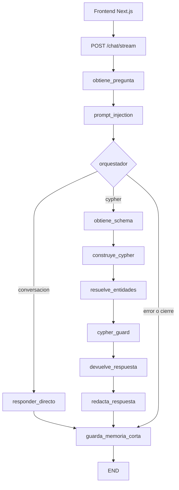

# CIAR — Flujo del agente

**Estado documentado:** 31 de agosto de 2026  
**Fuente de verdad:** código activo de `backend/agente`, `backend/api` y `frontend/src`.

Este documento describe el recorrido de una pregunta desde el frontend hasta la respuesta
final. El agente trabaja con consultas de dominio de solo lectura sobre Neo4j; no acepta
Cypher arbitrario desde la API pública.

## 1. Recorrido general



El grafo se registra en
[`backend/agente/grafo/constructor.py`](../backend/agente/grafo/constructor.py).

## 2. Entrada HTTP y streaming

El frontend usa `useStream` y envía una solicitud a `/chat/stream`. Next.js redirige esa
ruta al backend mediante `frontend/next.config.js` y la variable `API_URL`.

El backend (`backend/api/servidor.py`):

1. valida el campo `pregunta`;
2. normaliza o genera `thread_id`;
3. deriva un scope de memoria a partir de la identidad anónima y el thread;
4. ejecuta el grafo dentro de un timeout y de una sección serializada de memoria;
5. emite eventos SSE `values` con fases y estado público;
6. termina con un evento SSE `end`.

Solo se exponen `respuesta`, `filas`, `cypher`, `error` y `fase`. El schema, historial,
parámetros internos y credenciales nunca se envían al navegador.

## 3. Nodos en orden

| Nodo | Función | Resultado principal |
|---|---|---|
| `obtiene_pregunta` | Recibe la pregunta ya validada por la API | `pregunta`, `error=None` |
| `prompt_injection` | Valida longitud, caracteres y patrones peligrosos | Rechazo seguro o pregunta válida |
| `orquestador` | Decide si la solicitud es conversación o consulta de datos | `ruta=conversacion` o `ruta=cypher` |
| `responder_directo` | Responde saludos, capacidades y conversación general con OpenAI | `respuesta` |
| `obtiene_schema` | Obtiene el snapshot vigente de labels, propiedades y relaciones | `schema` |
| `construye_cypher` | Genera Cypher parametrizado usando el schema | `cypher`, `parameters`, `query_limit` |
| `resuelve_entidades` | Canonicaliza IDs y valores textuales contra el schema/datos | Parámetros resueltos o error seguro |
| `cypher_guard` | Aplica la política final de solo lectura | Cypher aceptado o bloqueado |
| `devuelve_respuesta` | Ejecuta la consulta por el gateway Neo4j `READ` | `filas` y respuesta determinista |
| `redacta_respuesta` | Explica las filas con afirmaciones ancladas a datos | Respuesta pública final |
| `guarda_memoria_corta` | Guarda la pregunta solo si la ejecución fue exitosa | Turno persistido en memoria de proceso |

## 4. Bifurcación del orquestador

### Ruta conversacional

Se usa para un saludo como `hola`, una pregunta sobre las capacidades del agente o una
solicitud que no necesita consultar el grafo:

```text
orquestador → responder_directo → guarda_memoria_corta → END
```

Si el modelo del orquestador falla, el código actual degrada a esta ruta para evitar una
decisión insegura. Si también falla el modelo directo, se devuelve una respuesta segura con
`error=direct_response_failed`.

### Ruta de datos

Se usa para preguntas que requieren información académica o laboral:

```text
orquestador
→ obtiene_schema
→ construye_cypher
→ resuelve_entidades
→ cypher_guard
→ devuelve_respuesta
→ redacta_respuesta
→ guarda_memoria_corta
→ END
```

## 5. Generación y validación de Cypher

`construye_cypher` recibe la pregunta original validada y un resumen del schema vivo. El
modelo debe devolver una estructura con:

```json
{
  "cypher": "MATCH ... RETURN ... LIMIT $limite",
  "parameters": {"limite": 20}
}
```

Antes de continuar, Python verifica que:

- los labels, propiedades y relaciones existan en el schema;
- los valores viajen como parámetros, no como literales interpolados;
- la consulta sea compatible con la política de lectura;
- el límite sea válido;
- la dirección de relaciones sea coherente con el schema.

Se permite como máximo un segundo intento cuando la salida estructurada o el schema son
inválidos.

## 6. Resolución de entidades y texto

La resolución no contiene reglas específicas como `coordinador`. Descubre el objetivo a
partir de la consulta generada y del schema runtime.

Para un predicado como:

```cypher
MATCH (c:Curso)
WHERE c.coordinador IS NOT NULL
  AND toLower(c.coordinador) CONTAINS toLower($profesora)
RETURN c.nombre_curso AS curso
```

el resolver identifica dinámicamente:

```text
$profesora → (label=Curso, property=coordinador)
```

El orden de búsqueda es:

1. intenta el índice full-text que cubra ese label y propiedad;
2. construye una consulta Lucene fuzzy acotada, por ejemplo `angla~2 AND mayhua~2`;
3. si no hay índice, no hay privilegio o la consulta falla, usa un catálogo paginado;
4. normaliza mayúsculas, minúsculas, tildes, puntuación y espacios;
5. sustituye el parámetro solo cuando existe una coincidencia única y suficientemente
   confiable;
6. conserva el texto original cuando la coincidencia es ambigua o insegura.

El fallback consulta páginas de 64 valores y tiene un máximo de 1024 candidatos. Esto evita
depender únicamente de que el valor buscado aparezca en los primeros resultados.

## 7. Guardias y acceso a Neo4j

Hay tres controles consecutivos:

1. validación de entrada y prompt injection;
2. validación estructural del Cypher generado;
3. `cypher_guard` inmediatamente antes de ejecutar.

El gateway de `backend/agente/utils/db.py` vuelve a validar la consulta, ejecuta `EXPLAIN`,
comprueba que sea de lectura y después ejecuta con routing Neo4j `READ`. La API de chat no
puede ejecutar `CREATE`, `MERGE`, `DELETE`, `SET`, `CALL` arbitrario ni consultas recibidas
directamente del cliente.

Si Neo4j no está disponible, el schema no corresponde al contrato o la consulta es bloqueada,
el flujo termina con un mensaje seguro y no publica datos parciales.

## 8. Respuesta fundamentada

`devuelve_respuesta` limita y normaliza las filas recibidas. Si no hay filas, produce una
respuesta determinista de “no encontré datos”. Si existen filas, `redacta_respuesta` pide al
analista una respuesta estructurada con referencias a filas.

El inspector local rechaza afirmaciones que:

- no citan una fila existente;
- introducen números no presentes en la fila;
- mencionan valores de otra fila;
- exponen identificadores cuando la pregunta no los solicitó.

Si el analista falla o genera texto no fundamentado, se utiliza un fallback con los datos
verificados en vez de inventar una explicación.

## 9. Memoria conversacional

La contextualización automática de seguimientos está desactivada temporalmente: el grafo no
ejecuta `contextualiza_pregunta` ni `contextualized_prompt_injection`. La memoria solo se
escribe al final en `guarda_memoria_corta`, guardando la pregunta original cuando no hay error
y existe una respuesta.

Características actuales:

- scope aislado por usuario anónimo y `thread_id`;
- máximo de 4 turnos por conversación;
- TTL de 30 minutos;
- límites globales de scopes y entradas;
- serialización por scope para evitar carreras entre solicitudes concurrentes;
- ancla acotada de resultados de cursos para preguntas de seguimiento;
- memoria en proceso: se pierde al reiniciar el backend y no se comparte entre réplicas.

Las utilidades de memoria/contextualización se conservan aisladas para una futura reactivación.
Mientras tanto, ningún turno previo se inyecta en el prompt del orquestador o del generador de
Cypher.

## 10. Errores visibles en el frontend

Durante el streaming, las fases habituales son:

```text
analizando
→ preparando_consulta
→ validando_consulta
→ consultando_grafo
→ redactando
→ completado
```

Si solo aparecen `analizando` y `redactando`, y el estado final contiene únicamente
`error`, `fase` y `respuesta`, normalmente se ejecutó la ruta conversacional y no se llegó a
Neo4j. Por ejemplo, un fallo del modelo del orquestador puede degradar a `responder_directo`.

`stream_completed` con `status=degraded` significa que el canal SSE terminó correctamente,
pero el grafo devolvió una respuesta degradada. No significa necesariamente que se haya
perdido la conexión.

## 11. Ejemplo de recorrido exitoso

Pregunta:

```text
¿Cuántas carreras hay?
```

Recorrido esperado:

```text
orquestador = cypher
→ obtiene_schema = snapshot de Neo4j
→ construye_cypher = MATCH (...) RETURN count(...) AS total
→ resuelve_entidades = sin parámetros textuales que resolver
→ cypher_guard = aceptado, solo lectura
→ devuelve_respuesta = filas verificadas
→ redacta_respuesta = “Hay 14 carreras.”
→ guarda_memoria_corta
```

Pregunta conversacional:

```text
hola
```

Recorrido esperado:

```text
orquestador = conversacion
→ responder_directo
→ guarda_memoria_corta
```

## 12. Diagnóstico operativo

Los modelos de los tres roles se configuran en `backend/.env`:

```dotenv
OPENAI_MODEL_ORQUESTADOR=...
OPENAI_MODEL_GENERADOR_CYPHER=...
OPENAI_MODEL_ANALISTA=...
```

Si un modelo no existe en la cuenta, el orquestador puede degradar a conversación y el
frontend mostrará un error genérico. La disponibilidad de Neo4j no garantiza la disponibilidad
de OpenAI.

Para verificar el recorrido sin frontend:

```powershell
cd backend
python scripts/consola.py
```

Para ejecutar la API:

```powershell
cd backend
python -m uvicorn api.servidor:app --reload --host 127.0.0.1 --port 8002
```

Para ejecutar el frontend:

```powershell
cd frontend
npm run dev -- --hostname 127.0.0.1 --port 3001
```
