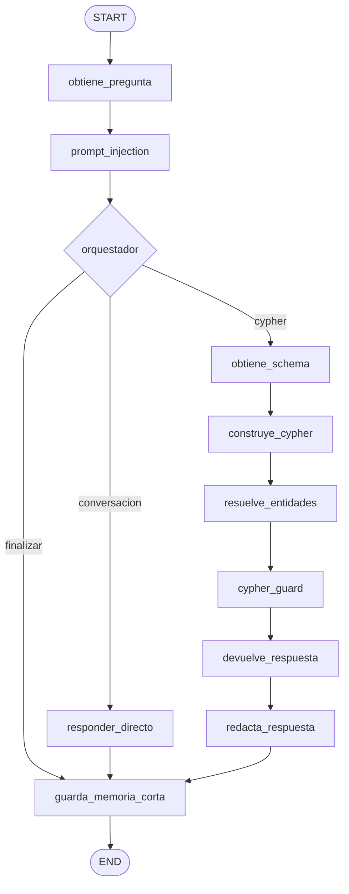

# Arquitectura del Grafo LangGraph

El agente de empleabilidad CIAR utiliza **LangGraph** para estructurar su ciclo de procesamiento como un autómata de estados finito y fuertemente tipado. El grafo aísla de manera explícita la intención conversacional de la ejecución de consultas sobre el grafo de conocimiento en Neo4j.

## Topología del Grafo

El grafo se compila mediante `construir_grafo()` en `backend/agente/grafo/constructor.py` a partir de un `StateGraph(Estado)` sin necesidad de checkpointer de base de datos, garantizando aislamiento total por solicitud y minimizando la superficie de estado retenido.



## Etapas del Ciclo de Vida

### 1. Ingesta y Seguridad Perimetral
- **`obtiene_pregunta`**: Normaliza el texto de entrada y extrae la consulta enviada por el usuario o cliente API.
- **`prompt_injection`**: Realiza una inspección preliminar de seguridad para abortar o neutralizar intentos de evasión de restricciones antes de involucrar al orquestador.

### 2. Bifurcación Semántica (Orquestador)
- **`orquestador`**: Invoca el modelo clasificador/orquestador (`OPENAI_MODEL_ORQUESTADOR`). Su función es categorizar la consulta en dos rutas primarias:
  1. `conversacion`: Preguntas de cortesía, consultas de capacidades o charla general. Se desvía a `responder_directo`.
  2. `cypher`: Preguntas sobre hechos académicos, empleabilidad, mallas curriculares, empresas u ofertas laborales. Continúa hacia la canalización de consulta a base de datos.
  3. `finalizar`: Casos de error o consultas inválidas que van directo al almacenamiento de memoria corta.

### 3. Pipeline de Generación y Ejecución de Consulta
- **`obtiene_schema`**: Carga el snapshot del esquema de Neo4j (con caché TTL en memoria) para proporcionar el contexto estructural al generador.
- **`construye_cypher`**: El modelo generador traduce la pregunta en una sentencia Cypher formal respetando el contrato de solo lectura.
- **`resuelve_entidades`**: Resuelve coincidencias difusas o exactas de nombres de carreras, competencias o tecnologías contra el grafo.
- **`cypher_guard`**: Validador AST y léxico que bloquea de forma estricta cualquier cláusula mutacional (`CREATE`, `MERGE`, `DELETE`, `SET`, `REMOVE`, `CALL apoc...`).
- **`devuelve_respuesta`**: Ejecuta la consulta validada en Neo4j usando exclusivamente un router de sesión de solo lectura (`READ`).
- **`redacta_respuesta`**: El modelo analista sintetiza los registros tabulares verificados en una respuesta clara y profesional en lenguaje natural, omitiendo identificadores internos a menos que se hayan pedido explícitamente.

### 4. Memoria Conversacional Acotada
- **`guarda_memoria_corta`**: Almacena en memoria de proceso (`ConversationMemory`) los turnos exitosos.
- **Límites estrictos**: Por diseño, retiene un máximo de 4 turnos con un TTL de 30 minutos. La memoria conversacional **no reescribe preguntas subsecuentes**, evitando la acumulación descontrolada de contexto y alucinaciones por deriva.

## Esquema del Estado (`Estado`)

El estado compartido a lo largo del grafo se modela mediante el `TypedDict` `Estado` en `backend/agente/grafo/estado.py`:

```python
class Estado(TypedDict, total=False):
    trace_id: str
    pregunta: str
    pregunta_original: str
    pregunta_mejorada: str
    memory_scope: str
    schema: Neo4jSchemaSnapshot
    cypher: str
    parameters: dict[str, Any]
    query_limit: int
    cardinality: str
    entity_resolution: str
    respuesta: str
    filas: list[dict[str, Any]]
    error: str | None
    warning: str | None
    ruta: str
```
