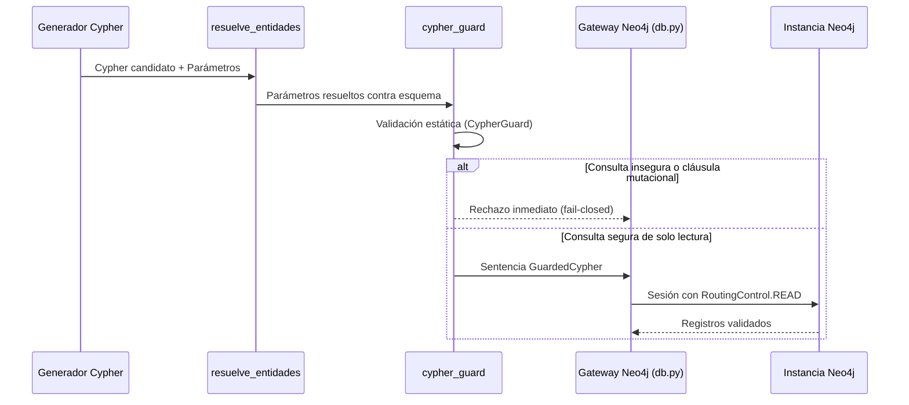

# Integración con Neo4j y Capa de Seguridad Cypher

La seguridad del acceso a la base de datos de grafos en CIAR se rige por un principio fundamental: **aislamiento estricto de solo lectura y validación estática de consultas a prueba de fallos (*fail-closed*)**. Ningún endpoint expuesto acepta Cypher arbitrario, y todas las sentencias generadas por modelos de lenguaje son analizadas antes de su ejecución.

## Enrutamiento y Conectividad a Neo4j

El módulo `backend/agente/utils/db.py` encapsula la conectividad con el driver oficial asíncrono de Neo4j (`neo4j.AsyncGraphDatabase`).

### Reglas de Conexión y Concurrencia
- **Enrutamiento de solo lectura:** Todas las transacciones de dominio se ejecutan forzando `routing_=RoutingControl.READ`. Esto asegura que el clúster o la instancia desvíe el tráfico exclusivamente a réplicas de lectura y rechace cualquier intento de mutación a nivel del motor.
- **Precedencia de credenciales:** Se da prioridad a las variables de lectura dedicadas (`NEO4J_READ_URI`, `NEO4J_READ_USER`, `NEO4J_READ_PASSWORD`), retrocediendo en bloque a las variables principales (`NEO4J_URI`, `NEO4J_USER`, `NEO4J_PASSWORD`) solo si no se configuran las primeras.
- **Timeout y límites:** Las consultas imponen un tiempo límite por defecto (`DEFAULT_QUERY_TIMEOUT_SECONDS = 15.0`) y un límite máximo de resultados por consulta (`MAX_QUERY_LIMIT = 100`).

## Cypher Guard: Validación Estática

La función `cypher_guard` en `backend/agente/nodos/cypher_guard.py` actúa como la última compuerta determinista antes de la base de datos. Utiliza el analizador léxico `guard_cypher()` (`backend/agente/utils/cypher_guard.py`):

1. **Lista de exclusión estricta (*Forbidden Words*):**
   Cualquier consulta que contenga cláusulas de modificación, administración o llamadas a procedimientos arbitrarios es rechazada inmediatamente. Entre las palabras reservadas prohibidas se incluyen:
   - Modificación: `CREATE`, `MERGE`, `DELETE`, `DETACH`, `SET`, `REMOVE`
   - Procedimientos y llamadas: `CALL`, `YIELD`, `LOAD`, `FOREACH`
   - Esquema y administración: `DROP`, `ALTER`, `GRANT`, `DENY`, `REVOKE`, `DATABASE`
2. **Parametrización obligatoria:**
   Los valores dinámicos no deben concatenarse en la cadena de consulta; se exige el uso de parámetros tipados (`$parametro`) que son cotejados con el mapa de parámetros de entrada.
3. **Manejo de errores:**
   Si la consulta es rechazada, se emite un error estructurado (`cypher_guard_failed`) y se devuelve un mensaje seguro predefinido (`SAFE_QUERY_ERROR`), evitando exponer detalles internos de la base de datos al usuario.

## Resolución de Entidades

Antes de ingresar al guardián estático, el nodo `resuelve_entidades` (`backend/agente/nodos/resuelve_entidades.py`) asegura que los nombres textuales ingresados en la consulta (ej. carreras, competencias o industrias) concuerden con los nodos reales presentes en el grafo:

- Normaliza cadenas textuales eliminando caracteres especiales y aplicando coincidencias exactas o aproximadas.
- Hidrata los parámetros del estado con identificadores o nombres canónicos verificados.
- Si una entidad no puede ser resuelta de manera inequívoca, aborta con `SAFE_ENTITY_RESOLUTION_ERROR` sin enviar consultas inválidas a Neo4j.
