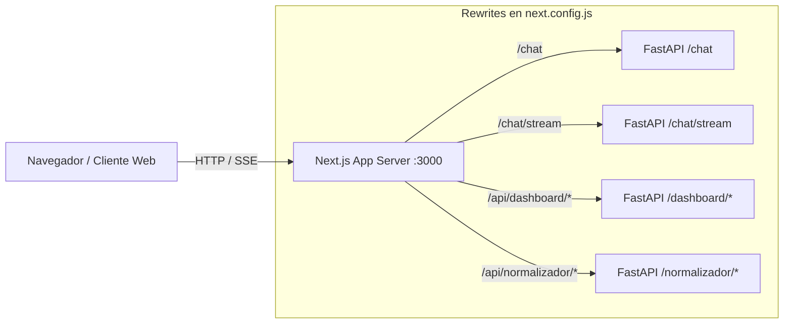

# Frontend y Visualización de Empleabilidad

La capa de presentación del agente CIAR está desarrollada con **Next.js** y **React 19**, proporcionando una interfaz web moderna para interactuar con el agente conversacional y explorar tableros analíticos de demanda laboral y cobertura curricular.

## Stack Tecnológico

Según se especifica en `frontend/package.json`, las dependencias clave incluyen:
- **Framework Core:** Next.js (`next@^16.2.10`) con React 19 (`react@^19.2.0`).
- **Visualización de Datos:** Recharts (`recharts@^3.8.0`) para trazar curvas de tendencias de ofertas laborales, distribución de competencias y brechas de conocimiento.
- **Iconografía y Estilos:** Lucide React (`lucide-react`) y Tailwind CSS (`tailwindcss@^3.4.17`).
- **Testing:** Vitest (`vitest@^3.2.4`) con React Testing Library y JSDOM.

## Enrutamiento y Conexión con el Backend

El archivo `frontend/next.config.js` actúa como un proxy inverso hacia el backend de FastAPI (por defecto en `http://127.0.0.1:8001`), evitando problemas de CORS y simplificando la topología de red:

### Reglas de Configuración Críticas
1. **Desactivación de compresión (`compress: false`):**
   Las respuestas generativas del agente utilizan Server-Sent Events (SSE) a través de `/chat/stream`. Si la compresión gzip estuviera habilitada, el proxy retendría paquetes para comprimir bloques, destruyendo la experiencia de streaming token a token en tiempo real.
2. **Límite de carga para multipart (`proxyClientMaxBodySize: "120mb"`):**
   Permite subir paquetes de sílabos en formato PDF o Excel hacia los servicios del normalizador curricular sin que Next.js bloquee la carga por tamaño excedido.
3. **Mapeo de Rutas REST:**
   - `/chat` y `/chat/stream` redirigen a los endpoints conversacionales del agente.
   - `/api/dashboard/:path*` canaliza consultas de demanda de carreras, competencias e industrias.
   - `/health` verifica el estado operativo global del stack.
