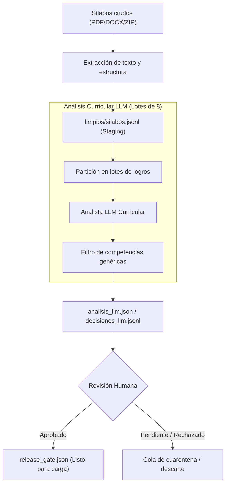

# Pipeline del Normalizador Curricular

El subsistema de normalización curricular de CIAR transforma sílabos universitarios no estructurados (PDF, DOCX) y reportes de empleabilidad en un conjunto de datos relacional y canónico apto para su integración en el grafo Neo4j.

## Filosofía del Pipeline: Evidencia y Supervisión Humana

A diferencia de los sistemas que insertan directamente salidas generativas en bases de datos, CIAR implementa una política estricta de **auditoría y preservación de evidencia**:
- Las propuestas generadas por modelos de lenguaje nunca se aprueban automáticamente, sin importar el nivel de certeza o confianza (*confidence score*).
- Todo cambio semántico genera artefactos durables de trazabilidad (`analisis_llm.json`, `decisiones_llm.jsonl`).
- La publicación hacia Neo4j requiere la aprobación explícita mediante un release gate (`release_gate.json`).

## Etapas de Procesamiento

### 1. Extracción y Staging
Los documentos se descomponen en secciones estándar (sumilla, unidades temáticas, logros de aprendizaje). El archivo `limpios/silabos.jsonl` almacena esta representación intermedia; por directriz de diseño, **no se considera un producto final**, sino una fase de staging previa al análisis contextual.

### 2. Análisis Semántico por Lotes
- **Partición:** El procesador agrupa los logros de aprendizaje en **lotes de 8 unidades** para optimizar la ventana de atención del modelo y mantener latencias predecibles.
- **Catálogo Canónico:** La inferencia contrasta las competencias extraídas contra el catálogo oficial CHH (`NORMALIZADOR_CATALOGOS_DIR`). Está prohibido generar taxonomías inventadas en entornos reales.
- **Exclusión de Competencias Transversales:** Las habilidades genéricas (ética, comunicación efectiva, trabajo en equipo) se identifican y excluyen explícitamente antes de la proyección canónica bajo la etiqueta `COMPETENCIA_GENERICA`, asegurando que el grafo retenga únicamente capacidades técnicas y de especialidad.

### 3. Compuerta de Liberación (*Release Gate*)
Cada ejecución recibe un identificador determinista (ej. `NOR_...`). Antes de autorizar la ingestión en la base de datos de producción:
1. Se verifica la proveniencia de cada asignación.
2. Se evalúan inconsistencias en `decisiones_llm.jsonl`.
3. Se firma el archivo `release_gate.json`. Solo con este pase administrativo, los scripts de ingestión proceden a cargar nodos y relaciones en Neo4j.
