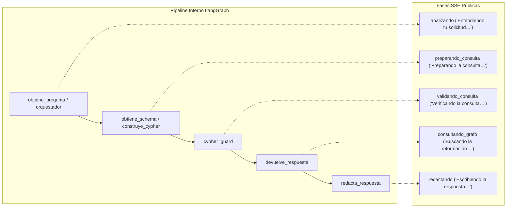

# Servicios API FastAPI y Métricas de Dashboard

La interfaz de servicios de CIAR está expuesta a través de **FastAPI** (`backend/api/servidor.py`), proveyendo endpoints REST y canales de streaming para la interacción conversacional y tableros analíticos de empleabilidad.

## Endpoints Conversacionales y Streaming SSE

La API ofrece dos modalidades de consumo para el agente conversacional:
1. **`POST /chat` (Sincrónico):** Procesa el grafo completo y devuelve el payload JSON con la respuesta final, identificador de traza y metadatos de ejecución.
2. **`POST /chat/stream` (Streaming SSE):** Transmite eventos en tiempo real mediante Server-Sent Events (SSE).

### Mapeo de Fases de Progreso
Para no exponer la complejidad interna de LangGraph al usuario final, el servidor mapea los nodos del pipeline a fases comprensibles (`STREAM_PHASE_BY_NODE` y `STREAM_PROGRESS_BY_NODE`):

Los tokens de texto se transmiten únicamente desde los nodos autorizados para hablar con el usuario (`USER_FACING_STREAM_NODES = {"redacta_respuesta", "responder_directo"}`).

### Protección contra Tiempos de Espera
Las ejecuciones del grafo imponen un límite global de tiempo (`DEFAULT_GRAPH_TIMEOUT_SECONDS = 90.0`). Si una consulta excede este umbral, el proceso se cancela de forma controlada y devuelve un mensaje de falla segura (`GRAPH_TIMEOUT_RESPONSE`).

## Servicios y Métricas del Dashboard

El backend provee endpoints analíticos agregados para alimentar la visualización de datos:
- `GET /dashboard/metadata`: Metadatos globales y límites de corte de datos.
- `GET /dashboard/filtros/carreras`: Catálogo de carreras y programas académicos disponibles.
- `GET /dashboard/ofertas/tendencia`: Volumen temporal de ofertas laborales por período.
- `GET /dashboard/carreras/demanda`: Demanda agregada de puestos laborales por especialidad.
- `GET /dashboard/dimensiones/{tipo}/demanda`: Demanda por dimensión (habilidades, herramientas, conocimientos).
- `GET /dashboard/dimensiones/{tipo}/brechas`: Comparativa entre lo demandado por la industria y la cobertura curricular.

### Sistema de Caché en Memoria (`consultas.py`)
Dado que las consultas analíticas del dashboard involucran agregaciones sobre el grafo, los resultados se almacenan en una caché en memoria thread-safe (`backend/agente/cache/consultas.py`):
- **Capacidad:** 256 entradas (`DEFAULT_QUERY_CACHE_MAX_ENTRIES`).
- **Expiración:** 600 segundos (`DEFAULT_QUERY_CACHE_TTL_SECONDS = 10 minutos`).
- **Llave de caché:** Huella criptográfica SHA-256 calculada sobre la sentencia Cypher y sus parámetros normalizados.
